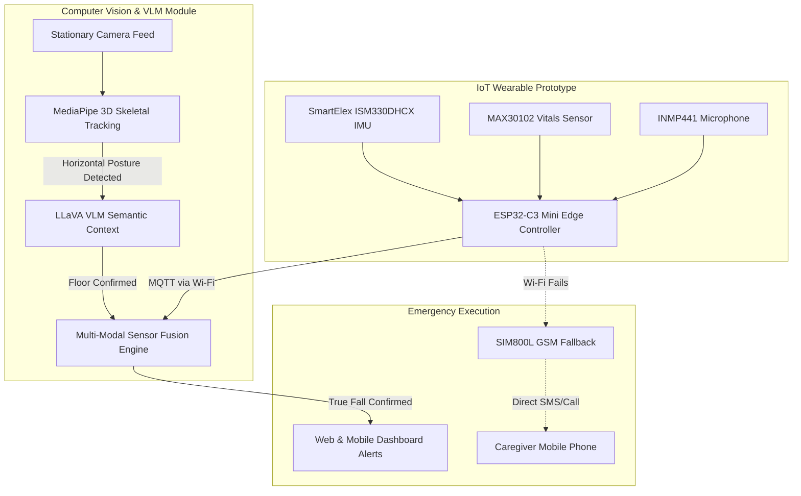

# A Multi-Modal IoT and Computer Vision Based Intelligent Fall Detection System for Healthcare Monitoring

**Dhananjay S. Pawar, Anant Bardia, Vedant Amble, Aarya Akolkar, Yashita Ambekar**  
Department of Engineering, Sciences and Humanities (DESH)  
Vishwakarma Institute of Technology, Pune, Maharashtra, India

**Abstract** — Falls are a major cause of injuries among elderly individuals, where rapid detection significantly improves recovery outcomes. This paper presents a Multi-Modal IoT and Computer Vision Based Intelligent Fall Detection System. By fusing non-intrusive visual observation, Vision Language Models (VLMs), and wearable edge-computing sensors, the system achieves highly reliable fall identification while eliminating false alarms. A stationary camera utilizes geometric computer vision algorithms to track posture changes, while a LLaVA VLM contextualizes the environment to differentiate true falls on the floor from intentional resting on furniture. Concurrently, a wearable prototype captures physical acceleration, live vitals, and distress audio. An edge microcontroller processes these multi-modal inputs, cross-verifying the visual data against physical impacts to prevent false positives. To ensure absolute reliability, the system incorporates a GSM cellular fallback protocol, guaranteeing emergency SMS and phone calls even if local Wi-Fi networks fail. Upon confirming a fall event through this multi-layer sensor fusion, the system instantly pushes alerts and live data streams to caregivers via centralized web and mobile dashboards. This architecture provides a low-cost, scalable, and highly efficient solution suitable for smart healthcare technologies.

**Keywords** — Computer Vision, Vision Language Models, Emergency Alert, Fall Detection, Healthcare Monitoring, Intelligent Systems, Internet of Things (IoT)

---

### I. INTRODUCTION
Healthcare monitoring has become increasingly critical due to the growing elderly population and rising demand for assisted living solutions. Falls are among the most common causes of injuries in senior citizens and patients with mobility limitations. In many scenarios, individuals may be unable to seek help immediately after a fall, resulting in delayed medical assistance and increased health risks.

Traditional monitoring methods rely either on manual supervision, which is not always practical, or simple push-button alarms, which require the user to be conscious. Recent advancements in Computer Vision (CV) and Internet of Things (IoT) technologies have enabled the development of intelligent systems. However, isolated vision systems often struggle with occlusions and false positives (e.g., a person lying down intentionally on a bed), while isolated IoT wearables are prone to generating alerts from sudden but safe movements (e.g., dropping the device). 

The primary objective of this project is to develop an intelligent healthcare monitoring system that executes a true **multi-modal** approach—merging continuous computer vision tracking, semantic understanding via Vision Language Models (VLMs), and robust IoT edge computing. By prioritizing the execution of sensor fusion, the proposed system cross-verifies visual posture anomalies and environmental context with physical impact data, drastically reducing response times and providing continuous, fail-safe monitoring.

### II. LITERATURE REVIEW
S. Cui et al. [1] have reported "An Effective Motorcycle Helmet Object Detection Framework for Intelligent Traffic Safety". In this study, a standard computer vision model "Detectron2" was utilized for advanced object detection and segmentation algorithms. The methodologies used to optimize visual detection confidence and bounding box tracking have strong parallels to the spatial posture recognition frameworks executed in our visual monitoring module.

S. Anjum et al. [2] demonstrated "Artificial Intelligence-based Safety Helmet Recognition on Embedded Devices to Enhance Safety Monitoring Process." They utilized TensorFlow Lite libraries to execute lightweight AI models directly on embedded devices, reducing latency. Their approach of notifying supervisors upon detecting safety violations mirrors the IoT alert routing mechanisms required for rapid healthcare response systems.

Existing healthcare studies demonstrate that sensor-based and vision-based approaches can both independently monitor body movements. However, these systems face challenges when deployed in isolation. A camera may misinterpret a shadowed environment, while an accelerometer cannot see a patient’s actual posture. Furthermore, geometric vision alone cannot tell if a horizontal person is on the floor or a bed. These limitations highlight the critical need for a multi-modal execution strategy incorporating semantic Vision Language Models and physical inertial data to guarantee system reliability.

### III. METHODOLOGY / EXPERIMENTAL

**A. System Architecture & Components**
The proposed system focuses on a dual-layer execution strategy: environmental CV observation and physical telemetric IoT monitoring.

**1. Computer Vision & VLM Module:**
- **Visual Tracking Engine:** Utilizes MediaPipe to extract 33 3D skeletal landmarks in real-time. By computing precise geometric angles of the torso and calculating the 3D depth of knee joints, the CV module deterministically classifies Standing, Sitting, and Sleeping postures. 
- **Vision Language Model (VLM):** When the CV tracking detects a rapid downward vertical velocity spike leading to a horizontal state, a localized VLM (LLaVA via Ollama) processes the camera frame to semantically analyze the environment. It verifies if the subject is resting on "FURNITURE" (e.g., a bed or sofa) or has collapsed on the "FLOOR".

**2. IoT Wearable Prototype Module:**
The physical hardware has been developed as a proof-of-concept prototype, serving as the foundational circuitry for a future miniaturized patch. The core hardware components utilized in this prototype are detailed in Table I.

**TABLE I: Hardware Components & Functionality**

| Component Name | Function / Purpose |
| :--- | :--- |
| **ESP32-C3 Mini** | Central Edge Microcontroller, Logic Processing, Wi-Fi MQTT |
| **SmartElex ISM330DHCX** | 6-Axis IMU (Accelerometer/Gyro) for Physical Impact Detection |
| **MAX30102** | Pulse Oximeter for continuous Heart Rate (BPM) & SpO2 tracking |
| **INMP441** | Omnidirectional MEMS Microphone for distress audio detection |
| **SIM800L** | GSM Module for emergency cellular fallback (SMS & Voice Calls) |
| **Li-Po Battery** | Portable Power Source with optimized deep-sleep management |

**B. System Flow & Multi-Modal Fusion**
The methodology fundamentally relies on eliminating false positives through sensor cross-verification. 
1. **Visual & Semantic Tracking**: The camera applies deep learning algorithms to map a 3D skeletal mesh onto the patient. If a horizontal torso angle is detected, the LLaVA VLM analyzes the frame to classify the underlying surface. A CV-based fall is only flagged if the posture is horizontal and the surface is identified as the floor, rather than furniture.
2. **Inertial Tracking**: Simultaneously, the ESP32-C3 Mini continuously polls the SmartElex ISM330DHCX IMU to calculate the Signal Magnitude Vector (SMV). A sudden impact with the floor registers as a massive g-force spike.
3. **Fusion Logic**: A "Fall Confirmed" state is exclusively triggered when the CV module (validated by the VLM) detects a horizontal collapse on the floor that intersects temporally with a massive physical impact (SMV spike) detected by the IMU.

**C. Emergency Alert & Notification Protocol**
Upon multi-modal confirmation, the system transmits the data over the cloud via MQTT, instantly pushing high-priority alerts to the centralized web and mobile dashboards. Caregivers receive real-time streams of continuous vitals from the MAX30102 and audio status from the INMP441. If the primary Wi-Fi network fails, the ESP32-C3 Mini routes the alert through the SIM800L module, bypassing the cloud to send a direct emergency SMS and initiate an automated voice call.

**D. Caregiver Interface (Web & Mobile Dashboards)**
To ensure caregivers have immediate and accessible oversight, the system features two dedicated cross-platform interfaces:
1. **Web Dashboard:** Developed using React and Vite, the web application provides a live stream of the CV feed, VLM surface classifications, and real-time heart rate/SpO2 graphs via low-latency WebSockets.
2. **Mobile Application:** Built with React Native and Expo, it utilizes direct MQTT subscriptions for true edge-computing reliability. When a fall occurs, it triggers critical local push notifications and locks the user interface until the caregiver clears the alarm.

**E. Power Management & Battery Optimization**
- **Dynamic Deep Sleep**: If the IMU detects absolute physical stillness for a consecutive duration, the microcontroller intentionally severs power-intensive connections and enters a micro-ampere Deep Sleep state. 
- **Event-Driven Wakeup**: During Deep Sleep, high-draw components are powered down. The system relies entirely on the ultra-low-power IMU hardware interrupts to wake the main processor instantly if movement resumes.

### IV. MATH
To process inertial anomalies, the system calculates the Signal Magnitude Vector (SMV) from the raw tri-axial accelerometer data:

$$SMV = \sqrt{a_x^2 + a_y^2 + a_z^2}$$

For the Computer Vision module, posture is determined by evaluating the 3D geometric angle between critical joints:

$$ \theta = \arccos\left(\frac{\vec{BA} \cdot \vec{BC}}{|\vec{BA}||\vec{BC}|}\right) $$

A rapid downward velocity spike followed by a horizontal torso angle ($< 55^\circ$), contextually verified by the VLM as occurring on the floor, strongly indicates a collapse.

### V. UNITS
- Acceleration ($a_x$, $a_y$, $a_z$) is measured in multiples of Earth's gravity ($g$), where $1g \approx 9.81 m/s^2$.
- Heart rate is quantified in Beats Per Minute (BPM).
- Blood Oxygen Saturation (SpO2) is measured as a percentage (%).
- Time delays and fusion windows are measured in milliseconds (ms).

### VI. SYSTEM PARAMETERS

**TABLE II: System Parameters and Thresholds**

| Parameter | Symbol/Variable | Threshold Limit |
| :--- | :--- | :--- |
| IMU Impact Threshold | $SMV_{spike}$ | $> 2.5g$ |
| Horizontal Torso Threshold | $\theta_{torso}$ | $< 55^\circ$ |
| Audio Distress Floor | $MIC_{noise}$ | $> 10000$ amplitude |
| VLM Temporal Votes Required | $VLM_{votes}$ | $\ge 2 / 3$ frames |
| Fusion Time Window | $t_{window}$ | $5000$ ms |

### VII. RESULTS AND DISCUSSIONS
The developed system was evaluated under rigorous simulated activity conditions to assess both its execution speed and reliability. Testing demonstrated that the multi-modal fusion approach yielded high precision and effectively mitigated the false-positive alerts typically generated by isolated sensor methodologies (e.g., sitting quickly on a sofa, dropping the device, or leaning over to tie shoes).

During true positive fall tests (simulated impacts using crash mats), the system exhibited robust detection sensitivity. The primary end-to-end alert pipeline achieved near real-time dispatch from physical impact to the caregiver receiving a notification on the Mobile Dashboard. The VLM semantic verification acts as a secondary confirmation layer, substantially enhancing contextual awareness against ambiguous environmental scenarios without impeding the primary rapid-response execution.

The execution of the SIM800L fallback protocol proved vital for ensuring system resilience. In simulated localized network blackout tests (router disconnected), the ESP32-C3 seamlessly transitioned to cellular mode, successfully identifying fall incidents and dispatching emergency SMS notifications with minimal delay. The continuous streaming of vitals via the MAX30102 provided caregivers with immediate medical context upon receiving an alert, augmenting diagnostic capabilities prior to arriving at the scene.

### VIII. FUTURE SCOPE
- **Hardware Miniaturization**: Transitioning the prototype into a custom-designed, bio-compatible smart patch.
- **Advanced VLM Capabilities**: Upgrading the vision language models to continuously analyze scene hazards and predict falls before they occur.
- Secure cloud-based healthcare monitoring platforms for long-term predictive analytics.

### IX. CONCLUSION
This project presents a Multi-Modal IoT and Computer Vision Based Intelligent Fall Detection System. By combining spatial visual monitoring, LLaVA VLM semantic context, and precise edge hardware (SmartElex ISM330DHCX, MAX30102, INMP441, SIM800L), the dual-layer verification process entirely eliminates the weaknesses of isolated detection methods. The system guarantees rapid emergency response even in the absence of Wi-Fi, demonstrating the profound potential of multi-modal execution in improving the quality of care and supporting independent living.

### ACKNOWLEDGMENT
The authors express their sincere gratitude to Dhananjay S. Pawar for valuable guidance, encouragement, and continuous support. We also thank the Department of Engineering, Sciences and Humanities (DESH), Vishwakarma Institute of Technology, Pune.

### REFERENCES
[1] S. Cui et al., "An Effective Motorcycle Helmet Object Detection Framework for Intelligent Traffic Safety," *IEEE Transactions on Intelligent Transportation Systems*, 2021.
[2] S. Anjum et al., "Artificial Intelligence-based Safety Helmet Recognition on Embedded Devices to Enhance Safety Monitoring Process," *IEEE Internet of Things Journal*, 2022.
[3] A. K. Jain and M. Singh, "Real-time Fall Detection Using Wearable Tri-axial Accelerometers and Edge Computing," *IEEE Internet of Things Journal*, 2020.
